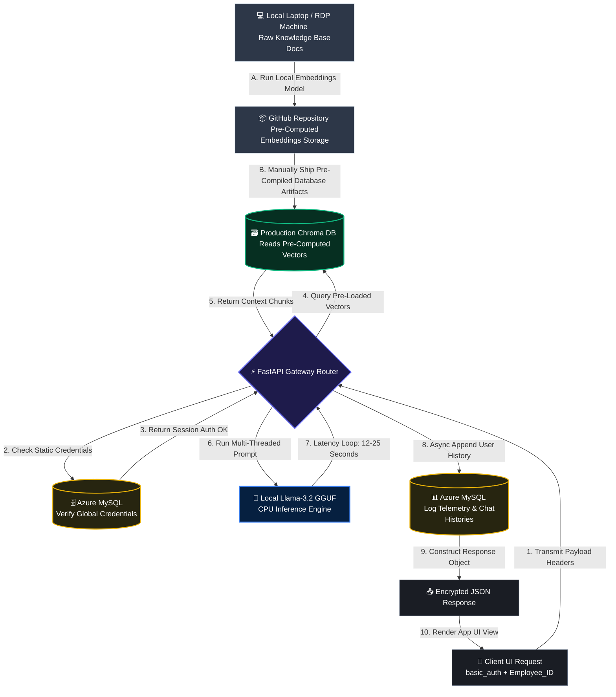

# Enterprise Local AI RAG Assistant for Corporate Governance

An enterprise-grade, resource-optimized Retrieval-Augmented Generation (RAG) system engineered to handle corporate reporting workflows, data privacy compliance, and organizational guidance. Designed and fully deployed on traditional, CPU-only cloud infrastructure, this architecture serves local quantized LLMs natively to achieve total compliance with enterprise data privacy mandates, completely eliminating commercial vendor subscription paths (saving \$20k–\$80k/year).

---

### Architectural Scope & Performance Metrics
* **Role:** Backend AI Developer & Knowledge Engineer
* **Target Infrastructure:** Traditional Azure Server (8 vCPUs, 8 GiB RAM, Zero-GPU Compute Footprint)
* **Ingestion Strategy:** Offline Decoupled Embedding Processing (Zero Production Overhead)
* **Knowledge Infrastructure:** Central Unified ChromaDB Vector Database

---

### System Data Flow & Telemetry Tracking Matrix

To maximize production compute cycles, data ingestion is completely decoupled from runtime execution. Document vector embeddings are generated offline on separate developer workstations and shipped directly as pre-compiled data weights. At runtime, the FastAPI app performs zero-overhead semantic searches and tracks usage by `Employee_ID` inside Azure MySQL.



---

### Key Technical Indicators & Engineering Implementations

* **Offline Decoupled Embedding Ingestion:** Designed a zero-overhead production ingestion strategy. By generating document embeddings locally on isolated RDP/workstation hardware and committing the pre-compiled database files straight to the repository, the production Azure server is completely protected from resource-heavy token embedding calculation loops.
* **Telemetry-Driven Audit Logging:** Engineered an isolated backend tracking mechanism that binds system computation usage, query history, and system exceptions directly to a unique `Employee_ID` string parameter while using a simplified basic authentication access gateway.
* **Traditional Azure Hardware Optimization:** Specifically configured to maximize CPU multi-threading and vector mathematical calculations on baseline virtual hardware configurations without requiring expensive GPU compute instances.
* **Hardened Instruction-Level Execution Tracing:** To guarantee absolute determinism and zero-fault data lineage under strict corporate compliance mandates, the backend implements a granular line-by-line audit framework. By piping static execution state markers directly into MySQL stored procedures after sequential code blocks using async thread pools (`run_in_threadpool`), the application isolates runtime anomalies and benchmarks code performance with microsecond precision directly on the Azure host machine.


---

### Enterprise Repository File System Architecture

```text
├── .env.template          # Global environment variable blueprint
├── Dockerfile             # Code to Deploy the program to Azure Server using Ubuntu Latest
├── requirements.txt       # Unified system Python dependencies
├── main.py                # Primary FastAPI application entry endpoint (Routing Layer)
├── config.py              # Configuration manager and database connections
├── exceptions.py          # Unified system exception handlers and MySQL logging
├── Model                  # Local AI GGUF Model (Llama 3.2) invoked by llama server  
├── bin/                   # Production Ubuntu binary (Unzipped automatically via Dockerfile)
├── bin2/                  # Local Windows binary (Leveraged for isolated desktop testing)
└── central/               # Application core configurations, schemas, and database mappings
    ├── database/vectordb  # PRE-COMPUTED DATA VECTORS (Committed manually via Git)
    ├── db.py              # Central MySql Database Models in SQLAlchemy
    ├── prompts.py         # System prompt for the Local AI model
    └── schema.py          # Pydantic Model for User Queries
└── services/              # Core business processing microservices
    ├── dbops.py           # Store and retrieve chat history from MySQL Database
    ├── rag.py             # Central ChromaDB vectors retrieval, chat history, system prompt to generate response to user query.
    └── security.py        # Basic Useer Authentication executed on every user query
```

---

### Local Quick-Start Directory Execution

#### 1. Clone and Navigate to Infrastructure Workspace
```bash
git clone https://github.com/WajihZaman/local-ai-rag-assistant
cd local-ai-rag-assistant
```

#### 2. Establish Environment File Configuration
```bash
cp .env.template .env
```
