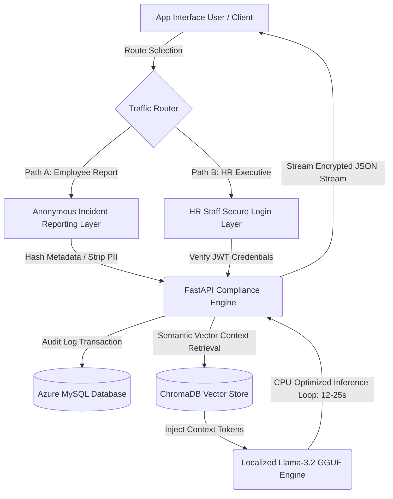

# 🤖 Enterprise Local AI RAG Assistant for HR Governance

An enterprise-grade, resource-optimized Retrieval-Augmented Generation (RAG) system engineered for high-security HR behavioral reporting and organizational compliance. Designed and fully deployed on traditional, CPU-only cloud infrastructure, this architecture serves local quantized LLMs natively to achieve total compliance with enterprise data privacy mandates, completely eliminating commercial vendor subscription paths (saving \$20k–\$80k/year).

---

### 📐 Architectural Role & System Overview
**Role:** AI Solution Architect & Knowledge Engineer  
**Target Infrastructure:** Traditional Azure Server (8 vCPUs, 8 GiB RAM, Zero-GPU Compute Footprint)  

To meet strict data sovereignty requirements, this system splits incoming traffic into two isolated operational modes, ensuring absolute user confidentiality while providing rich domain-specific information retrieval for management.

---

### 🗺️ System Data Flow & Dual-User Path Matrix



---

### 🚀 Key Technical Indicators & Structural Capabilities

* **Dual-Function Backend Separation:** 
  * **Employee Vector Path:** Provides a highly secure, cryptographic endpoint for anonymous workplace incident filing, instantly stripping out any personally identifiable information (PII) data parameters.
  * **HR Workflow Automation Path:** Provides structured, context-aware interactive guidance to help HR administrators navigate corporate handbooks, employment laws, and compliance procedures using semantic retrieval.
* **Traditional Azure Hardware Scaling:** Specifically compiled to maximize CPU multi-threading and vector mathematical calculations on baseline virtual hardware without requiring expensive GPU compute instances.
* **Stateful MySQL Enterprise Logs:** Utilizes an integrated database topology to log isolated system telemetry, process historical user chat states, and register application exception tracing streams safely.

---

### 📂 Enterprise Repository File System Architecture

```text
├── .env.template          # Global environment variable blueprint
├── requirements.txt       # Unified system Python dependencies
├── main.py                # Primary FastAPI application entry endpoint
├── config.py              # Configuration manager and database connections
├── exceptions.py          # Unified system exception handlers and logging
├── services/              # Core business processing microservices
│   ├── auth_service.py    # Multi-tenant user login and token generation
│   ├── compliance_auth.py # Anonymization middleware (PII stripping filter)
│   ├── rag_service.py     # ChromaDB retrieval, indexing, and embedding loop
│   └── llama_service.py   # Quantized Llama 3.2 token parsing streaming logic
└── bin/                   # Build scripts and runtime server automation
```

---

### 🚀 Local Quick-Start Directory Execution

#### 1. Clone and Navigate to Infrastructure Workspace
```bash
git clone https://github.com
cd local-ai-rag-assistant
```

#### 2. Establish Environment File Configuration
```bash
cp .env.template .env
```
*Open `.env` and populate your secure Azure system credentials.*

#### 3. Execute Environment Compilation via Docker Compose
```bash
docker-compose up --build -d
```
