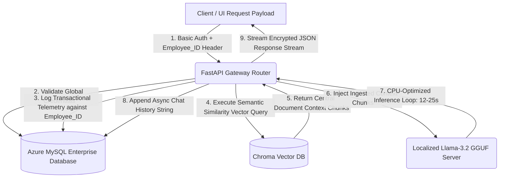

# 🤖 Enterprise Local AI RAG Assistant for Corporate Governance

An enterprise-grade, resource-optimized Retrieval-Augmented Generation (RAG) system engineered to handle corporate reporting workflows, data privacy compliance, and organizational guidance. Designed and fully deployed on traditional, CPU-only cloud infrastructure, this architecture serves local quantized LLMs natively to achieve total compliance with enterprise data privacy mandates, completely eliminating commercial vendor subscription paths (saving \$20k–\$80k/year).

---

### 📐 Architectural Scope & System Parameters
* **Role:** Backend AI Developer & Knowledge Engineer
* **Target Infrastructure:** Traditional Azure Server (8 vCPUs, 8 GiB RAM, Zero-GPU Compute Footprint)
* **Performance Metrics:** 12-25 seconds response latency loop under pure CPU execution.
* **Knowledge Infrastructure:** Unified central knowledge base served via ChromaDB to all authorized personnel.

---

### 🗺️ System Data Flow & Telemetry Tracking Matrix

The application leverages a lightweight Basic Authentication schema paired with a dedicated transactional tracking pipeline. To protect network overhead, a shared corporate credential grants access to the gateway, while a mandatory `Employee_ID` payload is injected into every request header to securely audit system usage, exception traces, and chat session histories inside an Azure MySQL instance.



---

### 🚀 Key Technical Indicators & Engineering Implementations

* **Telemetry-Driven Audit Logging:** Engineered an isolated backend tracking mechanism that binds system computation usage, query history, and system exceptions directly to a unique `Employee_ID` string parameter while using a simplified basic authentication access gateway.
* **Unified Vector Ingestion Framework:** Maintained a centralized document index database layout within ChromaDB, utilizing its native embedding layer to serve uniform, context-rich documentation arrays to all querying endpoints.
* **Traditional Azure Hardware Optimization:** Specifically configured to maximize CPU multi-threading and vector mathematical calculations on baseline virtual hardware configurations without requiring expensive GPU compute instances.
* **Stateful MySQL Chat Records:** Utilizes an integrated database topology to log isolated system telemetry, process historical user chat states, and register application exception tracing streams safely.

---

### 📂 Enterprise Repository File System Architecture

```text
├── .env.template          # Global environment variable blueprint
├── Dockerfile             # Global environment variable blueprint
├── requirements.txt       # Unified system Python dependencies
├── main.py                # Primary FastAPI application entry endpoint (Routing Layer)
├── config.py              # Configuration manager and database connections
├── exceptions.py          # Unified system exception handlers and MySQL logging
├── bin                    # Unified system exception handlers and MySQL logging
├── bin2                   # Unified system exception handlers and MySQL logging
└── central/               # Core business processing microservices
    ├── database/vectordb  # Basic Authentication parsing & Employee_ID verification
    ├── db.py              # Central ChromaDB retrieval, indexing, and embedding loops
    ├── prompts.py         # Central ChromaDB retrieval, indexing, and embedding loops
    └── schema.py          # Quantized Llama 3.2 token parsing streaming logic
└── services/              # Core business processing microservices
    ├── dbops.py           # Basic Authentication parsing & Employee_ID verification
    ├── rag.py             # Central ChromaDB retrieval, indexing, and embedding loops
    └── security.py        # Quantized Llama 3.2 token parsing streaming logic
```

---

### 🚀 Local Quick-Start Directory Execution

#### 1. Clone and Navigate to Infrastructure Workspace
```bash
git clone https://github.com
cd local-ai-rag-assistant
```

#### 2. Establish Environment File Configuration
```bash
cp .env.template .env
```
*Open `.env` and populate your secure Azure system credentials.*

#### 3. Execute Environment Compilation via Docker Compose
```bash
docker-compose up --build -d
```
